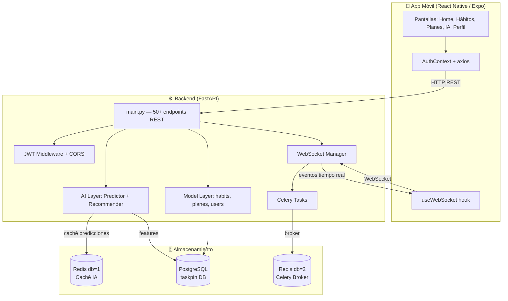
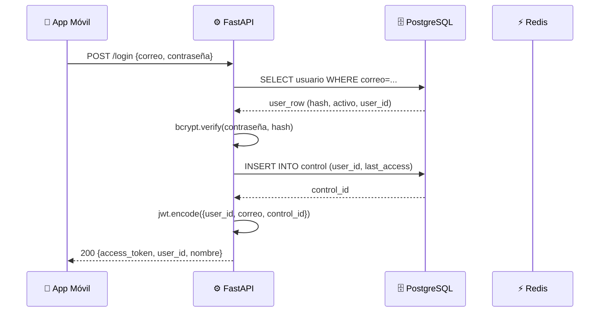
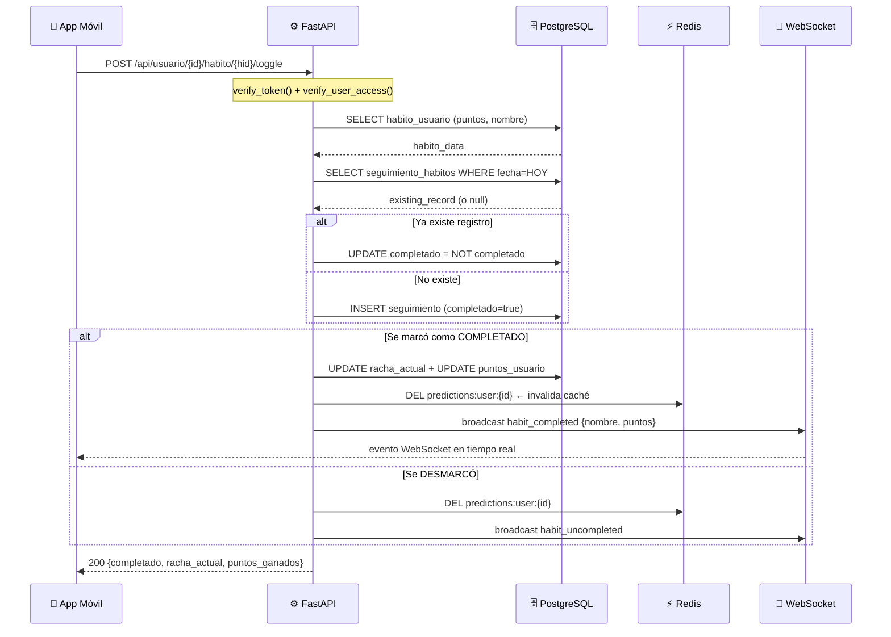
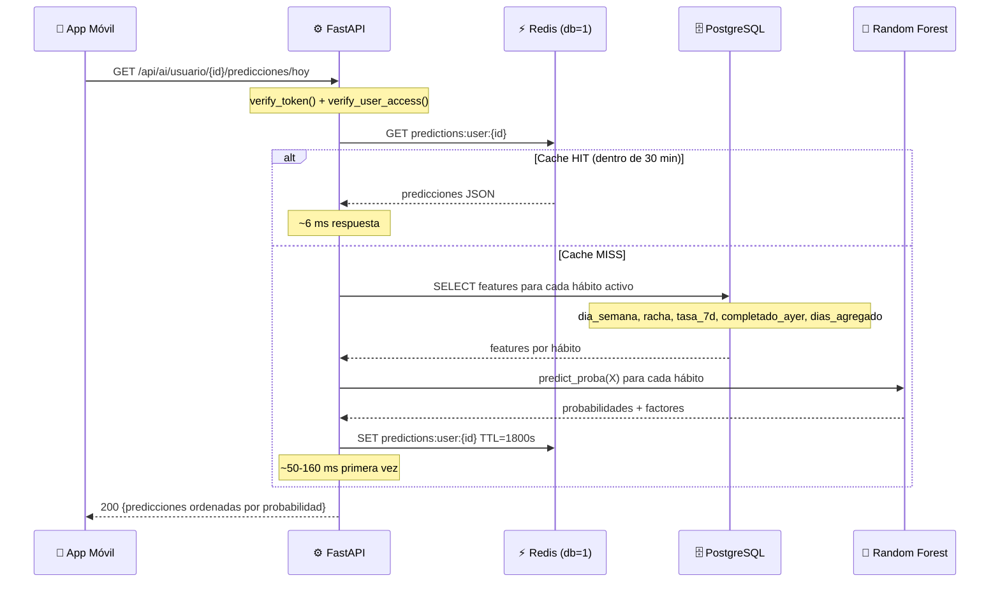
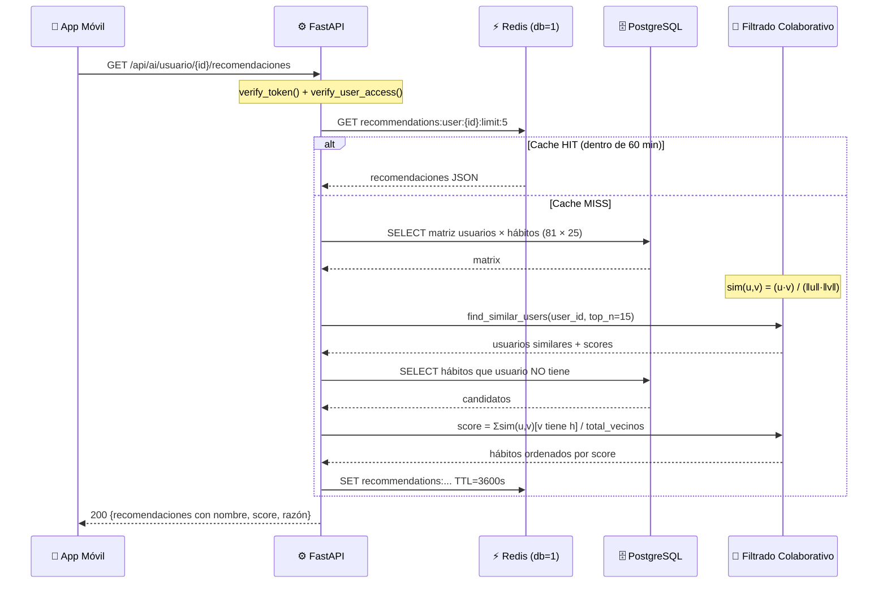
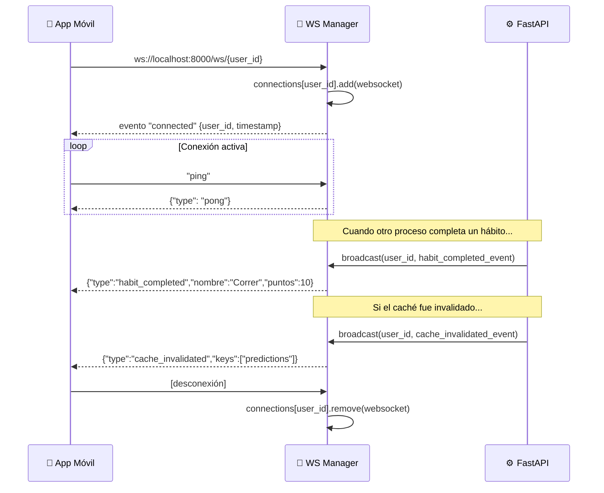

# Fase 5 — Arquitectura e Implementación del Sistema

> **Estado:** ✅ Completada  
> **Fecha:** 27 de Abril, 2026  
> **Diagramas:** ASCII + Mermaid (renderizables en GitHub, Notion, Obsidian)

---

## Para el compañero que redacta el documento

Esta fase responde a:

> *"Se requiere explicar con mayor detalle el proceso de implementación del sistema
> y la manera en que cada componente interactúa dentro de la solución completa."*

**Qué copiar al documento:**
- Sección **"Arquitectura del Sistema"**: diagrama 5.1 y tabla 5.2.
- Sección **"Flujo de Datos"**: flujos 5.3, 5.4, 5.5.
- Sección **"Descripción por Capa"**: tabla 5.6.
- Los diagramas Mermaid se pueden pegar en Notion/GitHub y se renderizan solos.
- Si el documento es Word/PDF, usar las versiones ASCII.

---

## 5.1 Diagrama de Componentes (Arquitectura General)

```
┌─────────────────────────────────────────────────────────────────┐
│                    DISPOSITIVO MÓVIL                            │
│                                                                 │
│  ┌─────────────────────────────────────────────────────────┐   │
│  │         App Taskpin (React Native / Expo SDK 53)        │   │
│  │                                                         │   │
│  │  ┌──────────┐  ┌──────────┐  ┌──────────┐  ┌───────┐  │   │
│  │  │  Tabs    │  │  Hábitos │  │  Planes  │  │  IA   │  │   │
│  │  │  Home    │  │  Sección │  │  Sección │  │  Tab  │  │   │
│  │  └──────────┘  └──────────┘  └──────────┘  └───────┘  │   │
│  │         │              │             │           │      │   │
│  │  ┌──────┴──────────────┴─────────────┴───────────┴──┐  │   │
│  │  │         AuthContext + axios + useWebSocket        │  │   │
│  │  └────────────────────────┬──────────────────────────┘  │   │
│  └───────────────────────────│─────────────────────────────┘   │
└──────────────────────────────│─────────────────────────────────┘
                               │
               HTTP REST / WebSocket (ws://)
                               │
┌──────────────────────────────▼─────────────────────────────────┐
│                   BACKEND (FastAPI / Python 3.11)               │
│                                                                 │
│  ┌──────────────────────────────────────────────────────────┐  │
│  │                    app/main.py                           │  │
│  │   50+ endpoints REST  ·  JWT Middleware  ·  CORS         │  │
│  │   WebSocket /ws/{user_id}                                │  │
│  └──────┬──────────────┬────────────────┬────────┬──────────┘  │
│         │              │                │        │              │
│  ┌──────▼───┐  ┌───────▼──┐  ┌─────────▼──┐ ┌──▼──────────┐  │
│  │  Model   │  │   AI     │  │  WebSocket │ │   Tasks     │  │
│  │  Layer   │  │  Layer   │  │  Manager   │ │  (Celery)   │  │
│  │          │  │          │  │            │ │             │  │
│  │ habits   │  │predictor │  │ events.py  │ │ ai_tasks.py │  │
│  │ planes   │  │recommndr │  │ manager.py │ │ train async │  │
│  │ users    │  │feat_extr │  │            │ │             │  │
│  └──────┬───┘  └───┬───┬──┘  └─────┬──────┘ └──┬──────────┘  │
│         │          │   │            │            │              │
└─────────│──────────│───│────────────│────────────│──────────────┘
          │          │   │            │            │
    ┌─────▼──┐  ┌────▼┐  └─────┐  ┌──▼────┐  ┌───▼───┐
    │  PostgreSQL  │  │Redis│        │ Redis │  │ Redis │
    │  Puerto 5433 │  │ db1 │        │  db1  │  │  db2  │
    │  taskpin DB  │  │cache│        │(WS aux)│  │broker │
    └─────────┘  └─────┘        └───────┘  └───────┘
    (datos permanentes) (caché IA)           (Celery)
```

---

## 5.1b Diagrama Mermaid (para Notion / GitHub)



---

## 5.2 Descripción de capas

| Capa | Tecnología | Responsabilidad |
|------|-----------|-----------------|
| **Presentación** | React Native, Expo Router | Pantallas, navegación, UI/UX |
| **Estado cliente** | AuthContext, AsyncStorage | Sesión, token JWT, datos locales |
| **Comunicación** | axios, httpx, WebSocket | HTTP REST + tiempo real |
| **API** | FastAPI, Pydantic v2 | Validación, routing, autenticación |
| **Negocio** | Python classes (Connection layer) | Lógica de hábitos, planes, estadísticas |
| **Inteligencia** | scikit-learn, NumPy | Predicción y recomendación |
| **Caché** | Redis (db=1) | TTL: predicciones 30 min, recomend. 60 min |
| **Mensajería** | Celery + Redis (db=2) | Entrenamiento asíncrono en background |
| **Persistencia** | PostgreSQL 14, psycopg-pool | Datos de usuario, hábitos, historial |
| **Tiempo real** | WebSocket (FastAPI nativo) | Notificaciones de eventos al instante |

---

## 5.3 Flujo de Secuencia — Login

```
App Móvil          FastAPI              PostgreSQL        Redis
    │                  │                     │               │
    │── POST /login ──►│                     │               │
    │   {correo,       │                     │               │
    │    contraseña}   │── SELECT user ──────►│               │
    │                  │◄── user row ─────────│               │
    │                  │                     │               │
    │                  │── bcrypt.verify() ──┐│               │
    │                  │◄── bool ────────────┘│               │
    │                  │                     │               │
    │                  │── INSERT control ───►│               │
    │                  │◄── control_id ───────│               │
    │                  │                     │               │
    │                  │── jwt.encode() ─────┐│               │
    │◄── 200 {token,   │◄── JWT string ──────┘│               │
    │    user_id}      │                     │               │
    │                  │                     │               │
```

**Mermaid:**



---

## 5.4 Flujo de Secuencia — Completar Hábito (Toggle)

Es el flujo más completo: involucra DB, caché, WebSocket y racha.

```
App Móvil        FastAPI           PostgreSQL       Redis       App (misma)
    │                │                  │              │            │
    │─ POST toggle ─►│                  │              │            │
    │  JWT token     │── verify_token() │              │            │
    │                │── SELECT habito ►│              │            │
    │                │◄── habito_data ──│              │            │
    │                │                  │              │            │
    │                │── SELECT seguim.►│              │            │
    │                │◄── existe? ──────│              │            │
    │                │                  │              │            │
    │                │── UPDATE/INSERT ►│  ← toggle    │            │
    │                │   completado     │              │            │
    │                │                  │              │            │
    │                │─── Lógica racha ─│  ← si completa           │
    │                │── UPDATE racha ─►│              │            │
    │                │                  │              │            │
    │                │── DEL cache ─────────────────►  │            │
    │                │   predictions:   │  ← invalida  │            │
    │                │   user:{id}      │     caché    │            │
    │                │                  │              │            │
    │                │── WS broadcast ──────────────────────────►  │
    │                │   habit_completed│              │  evento WS │
    │                │                  │              │            │
    │◄── 200 {status}│                  │              │            │
```

**Mermaid:**



---

## 5.5 Flujo de Secuencia — Predicciones IA (con caché)

```
App Móvil        FastAPI          Redis           DB          Predictor
    │                │               │             │               │
    │─ GET predic. ─►│               │             │               │
    │  JWT token     │── verify() ──►│             │               │
    │                │               │             │               │
    │                │─ GET cache ──►│             │               │
    │                │  predictions: │             │               │
    │                │  user:{id}    │             │               │
    │                │               │             │               │
    │           ╔════╧════╗          │             │               │
    │           ║ HIT?    ║          │             │               │
    │           ╚════╤════╝          │             │               │
    │                │               │             │               │
    │       SI ◄─────┤ NO ───────────┼─────────────►  SELECT      │
    │       │        │               │             │  features     │
    │       │        │               │             │◄─ features ───│
    │       │        │────────────────────────────────────────────►│
    │       │        │               │             │  predict()    │
    │       │        │◄───────────────────────────────────────────│
    │       │        │               │             │  predictions  │
    │       │        │─ SET cache ──►│  TTL 30 min │               │
    │       │        │               │             │               │
    │◄──────┘        │               │             │               │
    │  200 {predic.} │               │             │               │
```

**Mermaid:**



---

## 5.6 Flujo de Secuencia — Recomendaciones IA



---

## 5.7 Flujo de Secuencia — WebSocket en tiempo real



---

## 5.8 Descripción detallada por módulo

| Módulo | Archivo | Qué hace exactamente |
|--------|---------|---------------------|
| **Router + Auth** | `app/main.py` (L1–L200) | Define todos los endpoints, middlewares JWT, CORS, `verify_token()` con python-jose |
| **Pool de conexiones** | `app/database.py` | Pool psycopg compartido: min 2 conexiones, max 10, reconexión automática |
| **Predictor** | `app/ai/predictor.py` | Random Forest 100 árboles, carga modelo `.pkl` al arrancar, cache Redis 30 min |
| **Recomendador** | `app/ai/recommender.py` | Similitud coseno en NumPy, cache Redis 60 min, fallback a popularidad |
| **Feature extractor** | `app/ai/feature_extractor.py` | Queries SQL → vectores NumPy; construye matriz 81×25 |
| **Redis client** | `app/core/redis_client.py` | Wrapper con prefijo `taskpin:`, fallback graceful si Redis cae |
| **WS Manager** | `app/websocket/manager.py` | Dict `connections: {user_id: Set[WebSocket]}`, broadcast async |
| **WS Events** | `app/websocket/events.py` | Enum de tipos de evento + factory `create_event()` |
| **Celery Tasks** | `app/tasks/ai_tasks.py` | 3 tareas: train_model, generate_recommendations, generate_predictions |
| **Conexión hábitos** | `app/model/habitConnection.py` | CRUD completo + toggle + racha + puntos + historial |
| **Conexión planes** | `app/model/planesConnection.py` | CRUD + tareas diarias + timeline + vinculación con hábitos |
| **Conexión estadísticas** | `app/model/estadisticasConnection.py` | Métricas de progreso, rachas globales, puntos totales |

---

## 5.9 Estructura de carpetas del backend

```
Backend/
├── app/
│   ├── main.py              ← 2,461 líneas: API + routing + auth
│   ├── config.py            ← Variables de entorno (.env)
│   ├── database.py          ← Pool psycopg compartido
│   ├── ai/
│   │   ├── predictor.py     ← Random Forest + cache Redis
│   │   ├── recommender.py   ← Filtrado colaborativo + cache Redis
│   │   ├── feature_extractor.py ← SQL → NumPy
│   │   └── models/
│   │       └── predictor.pkl    ← Modelo entrenado serializado
│   ├── core/
│   │   └── redis_client.py  ← Cliente Redis con fallback
│   ├── model/               ← Capa de acceso a datos
│   │   ├── habitConnection.py
│   │   ├── planesConnection.py
│   │   ├── userConnection.py
│   │   ├── estadisticasConnection.py
│   │   └── reflexionesConnection.py
│   ├── schema/              ← Modelos Pydantic (validación)
│   │   ├── habitSchema.py
│   │   ├── planSchema.py
│   │   ├── userSchema.py
│   │   ├── aiSchema.py
│   │   ├── estadisticasSchema.py
│   │   └── reflexionSchema.py
│   ├── tasks/               ← Celery
│   │   ├── celery_app.py
│   │   └── ai_tasks.py
│   └── websocket/           ← WebSocket
│       ├── manager.py
│       └── events.py
├── scripts/                 ← Herramientas y evaluación
│   ├── seed_data.py
│   ├── seed_ai_50users.py
│   ├── evaluate_predictor.py
│   ├── evaluate_recommender.py
│   ├── benchmark.py
│   └── test_resilience.py
└── requirements.txt
```

---

*Este documento no requiere evidencia JSON — los diagramas son la evidencia.*
